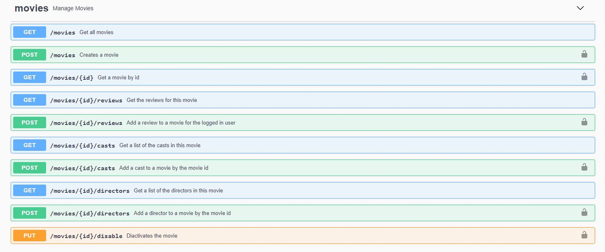
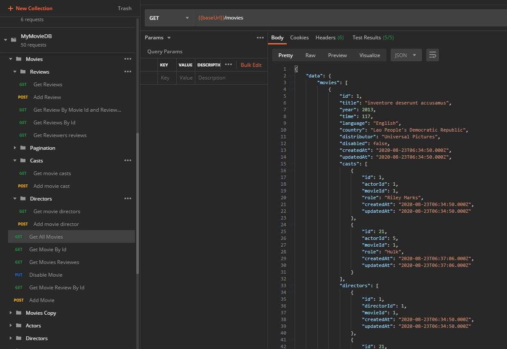

# MyMovieDB

Install dependencies:

> npm install

Run this project with typescript:

> npm start

Build the typescript project and run the js build files:

> npm run prod

Run the sequelize migrations:

> npx sequelize-cli db:migrate

Fill the database with data:

> npx sequelize-cli db:seed:all

## Swagger visualization

When the app is running, visit the endpoint /swagger to see the app api docs.

## Testing

Make sure the NODE_ENV is set to test

Sequelize will call the build/ js files for the configuration, so make sure the run:

> npx tsc

Run:

> npm run test

Based on the package.json file, this will create the test database in case it doesn't exist, remove any migrations, then add the migrations and fill it with seeds (about 20 records for each model.). The number of seeds can be changed in the .env file.

## Postman visualization and testing

There is a postman collection and environment files in API docs folder. Import them to postman to test the API from there

